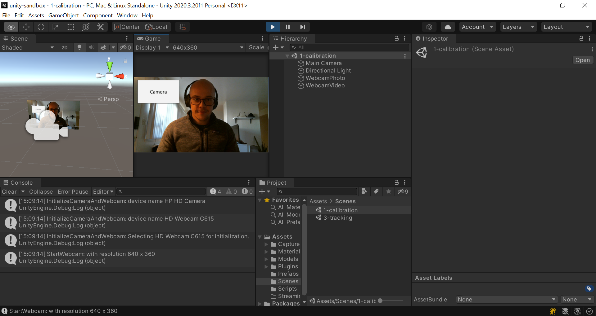
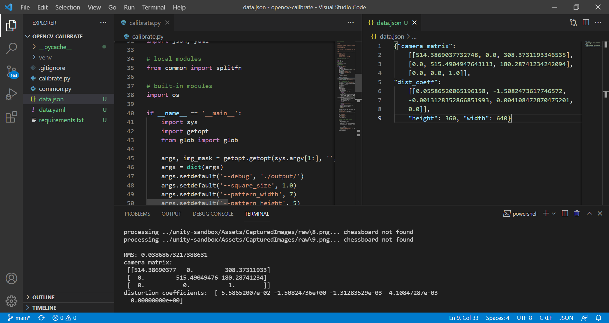
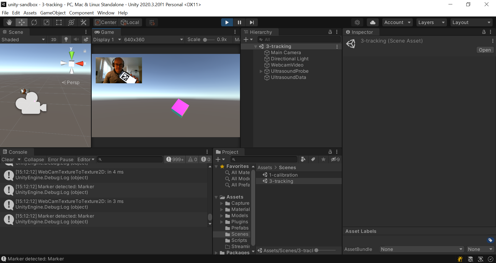

# Augmented Reality Ultrasound Training
Project for the [2021 Medical Augmented Reality Summer School](https://medicalaugmentedreality.org/). We present a low-cost monitor-based augmented reality training platform for at-home ultrasound skill development.

- [Towards a Low-Cost Monitor-Based Augmented Reality Training Platform for At-Home Ultrasound Skill Development](https://www.mdpi.com/2313-433X/8/11/305)

## Authors
- Marine Ying Shao, Tamara Vagg, Matthias Seibold, and Mitchell Doughty


## Table of contents
- [Overview](#overview)
- [Requirements](#requirements)
- [Steps to run](#steps-to-run)
- [Citation](#citation)

## Overview
- This project is incorporates elements from the [ThreeDPoseUnityBarracuda](https://github.com/digital-standard/ThreeDPoseUnityBarracuda) repository for reading a VRect onnx model with Barracuda and regressing a single 3D human pose within Unity 


## Requirements
- [Unity 2020 LTS](https://unity3d.com/unity/qa/lts-releases)
- [Visual Studio 2019](https://visualstudio.microsoft.com/downloads/)
- [Visual Studio Code](https://code.visualstudio.com/)
- [Python 3.9 for Windows](https://www.python.org/downloads/windows/)
- [Barracuda 1.0.5](https://docs.unity3d.com/Packages/com.unity.barracuda@1.0/manual/index.html)

## Steps to run
### 1. Calibration *(optional)*
- In the project folder, open and print the `chessboard.pdf` file and rigidly attach to a flat board
- Open the `unity-sandbox` Unity project
- In the `Scenes` folder, open `1-calibration`
- Play the Unity scene, live video from the webcam will appear
- Place the printed chessboard object in view of the camera and press spacebar on the keyboard to record an image
- Move chessboard around the field of view of the camera, record 25 images
- When complete, images will be saved to the `unity-sandbox\Assets\CapturedImages` folder



### 2. Compute camera parameters *(optional)*
- In the project folder, open the `opencv-calibrate` folder in Visual Studio Code
- Create a new virtual environment with the following command
```bash
pip install virtualenv
python -m virtualenv venv -p 3.9
pip install -r requirements.txt

python calibrate.py --square_size 0.03 --pattern_width 7 --pattern_height 5 --debug ../unity-sandbox/Assets/CapturedImages/output/ ../unity-sandbox/Assets/CapturedImages/raw/*.png
```
- Below is a sample `json` result of calibration
```
{"camera_matrix": [[677.8968352717175, 0.0, 439.2388714449508], [0.0, 677.1775976226464, 231.50848952714483], [0.0, 0.0,1.0]], "dist_coeff": [[-0.002602963842533594, -0.008751170499511022, -0.0022398259556777236, -5.941804169976817e-05, 0.0]], "height": 504, "width": 896}

```
- Formatting for Unity
```
677.8968352717175f, 677.1775976226464f, // focal length (0,0) & (1,1)
439.2388714449508f, 231.50848952714483f, // principal point (0,2) & (2,2)
-0.002602963842533594f, -0.008751170499511022f, 0.0f, // radial distortion (0,0) & (0,1) & (0,4)
-0.0022398259556777236f, -5.941804169976817e-05f, // tangential distortion (0,2) & (0,3)
504, 896); // image width and height
```


### 3. Marker and body pose tracking in Unity

- Generate your own ArUco marker using [this marker generator](https://chev.me/arucogen/)
- Ensure that the following parameters are set:
  - Dictionary: `6x6 (50, 100, 250, 1000)`
  - MarkerId: `2`
  - Marker Size (mm): `80`
  - Make sure to update the marker id and size in the Unity `WebcamTexture.cs` script attached to the `WebcamVideo` game object
- Download the `StreamingAssets.zip` file from the [following URL](https://drive.google.com/file/d/1bAVg1lT-RMwJh3_VpTUvgZ0-uZQv447p/view?usp=sharing)
  - Extract to `Assets/` folder
- Open the `unity-sandbox` Unity project
- In the `Scenes` folder, open `SampleScene`
- Download the ThreeDPoseUnityBarracuda ONNX model from the [following URL](https://digital-standard.com/threedpose/models/Resnet34_3inputs_448x448_20200609.onnx)
  - Place the ONNX model in `Assets/Scripts/Model/` and drag-and-drop it to `NN Model` on the `BarracudaRunner` Gameobject in Inspector view. 
- Play the Unity scene, live video from the webcam will appear
  - For optimal body tracking performance, ensure the entire body fits in the video frame and there is a simple background texture
- Follow the registration steps provided by the user interface and select each popup window with a mouse as they are completed
- Place the printed ArUco marker in view of the camera, the virtual ultrasound probe should track the pose (position and rotation) of this marker relative to your arm



## Citation
If you found this code repo useful, please consider citing the associated publication:

@article{shao2022towards,
  title={Towards a Low-Cost Monitor-Based Augmented Reality Training Platform for At-Home Ultrasound Skill Development},
  author={Shao, Marine Y and Vagg, Tamara and Seibold, Matthias and Doughty, Mitchell},
  journal={Journal of Imaging},
  volume={8},
  number={11},
  pages={305},
  year={2022},
  publisher={MDPI}
}
